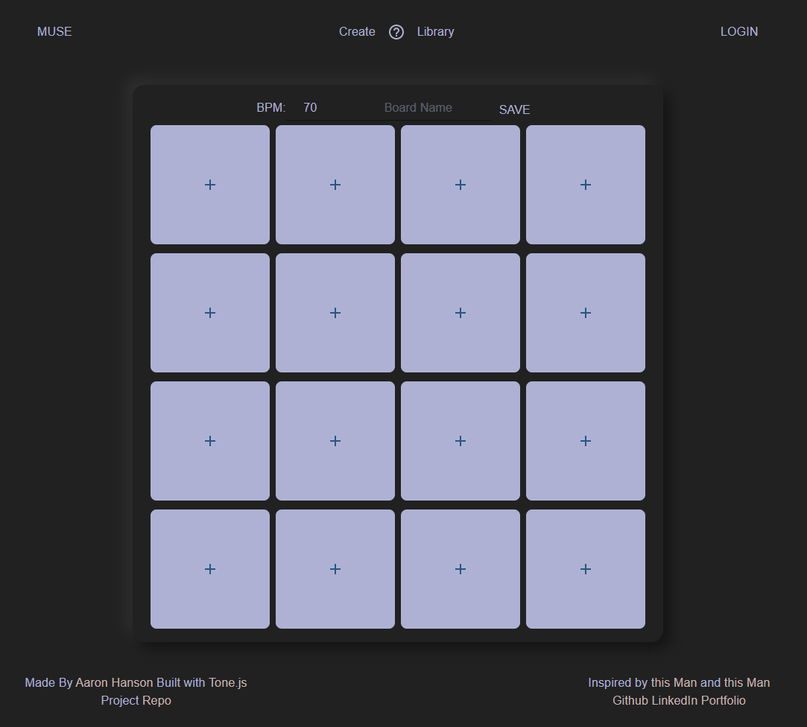
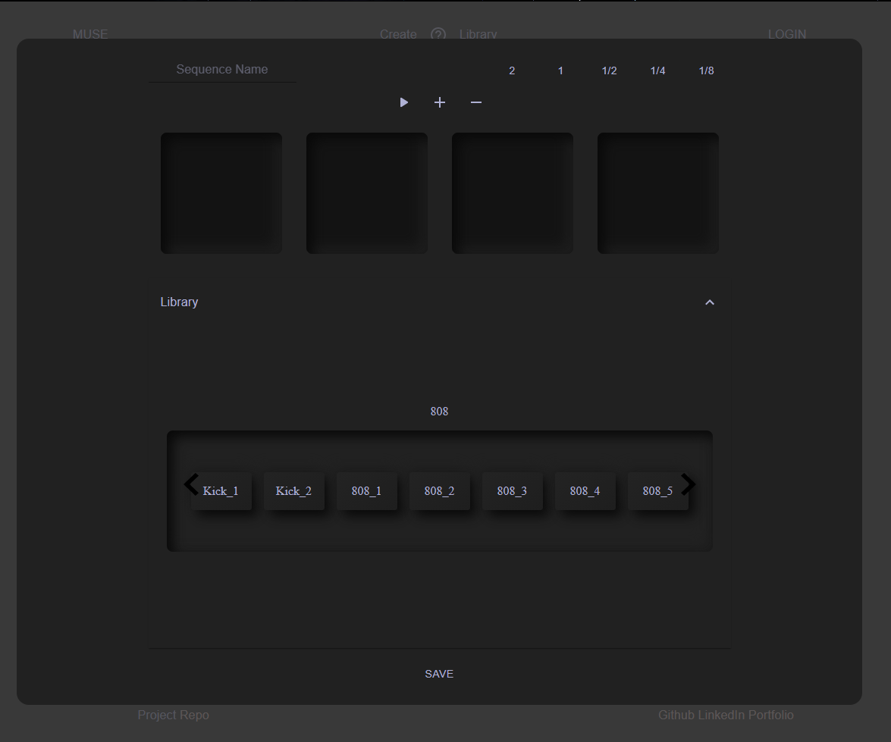

<div align="center">


# Muse 
## A Beat Making Production Application

**TOC**
[About](#about-Muse) ● [Features](#features) ● [How It Works](#how-it-works) ● [Installation](#installation) ● [Development](#development) ● [Contact Me](#contact-me)

**Create your foundational beat sequences and melodies in a pleasing distractionless application! 🌱**
Create and save beats to your own free personal library! 🖍️
Enjoy a clean aesthetic to boost your creativity and production. 💎





### Try the Demo!
<a href="https://musely.herokuapp.com/">
click here!
</a>

</div>

---

<div align="center">

## About Muse

[[ WEBSITE: https://musely.herokuapp.com/ ]](https://musely.herokuapp.com/)

</div>

Muse was inspired by Midi Fighter controllers and online beat sequencers that left a void where a much needed mixup could be.
Muse's minimalistic design is catered towards an intuitive, non intrusive user experience to allow the seemless transfer of ideas without distraction.
Muse allows music enthusiasts to explore music creation in the browser to its fullest with dynamic libraries and an intuitive beat creation design.

Each board that an artist creates, they are provided 16 different modifiable beat pads to create thier perfect beat sequence mix. Each pad can be customized in many ways ranging from the note signature to bpm and how long each bar is.

<br clear="both">

## Features
</div>

* Create boards populated with beats saved to a set of 16 buttons.
* Each button has a sequencer that you can drag notes from a library onto the playboard.
* Load and save previously created boards to and from your personal library.
* Set a global BPM.
* Select a local speed multiplier.

### Future Stretch Goals 
(in no particular order)
- **Follower Social System**
- **Custom Sound libraries**
- **Share Beat Boards wth friends**
- **Record your Jam**

<div align="center">

## How It Works

</div>

>
> **Users can:**
> 1. [Create a Sequence](#1-create-a-sequence)
> 2. [Add Notes](#2-add-notes)
> 3. [Add a Block](#3-add-blocks)
> 4. [Play a Saved Beat Pad](#4-play-a-saved-beatpad)
> 5. [Save / load Board](#5-save-or-load-your-board)
> 6. [Installation](#installation)
>

### 1. Create a Sequence


- To **create a sequence**, click on a empty beat pad indiciated with the + symbol.
- Drag notes, and customize the sequence to your interest.
- To **save**, give your sequence a name and click the save button at the bottom.

<br clear="both">

### 2. Add Notes

- To **add a note**, open the library dropdown and drag a desired note to one of boxes above it. You can add multiple notes to a block to subdivide a beat by its parts.
- To **remove a note**, open the library dropdown and drag the note to delete back into the library to take it off your sequence.
<br clear="both">

### 3. Add Blocks

- To **add a Block**, click the + button near the top to add a new block
- To **remove a Block**, click the - button next to the + button to remove the last block.

### 4. Play a Saved Beat Pad

- **After designing a desired sequence, give your new sequence a name.** Then click the save button at the bottom.
- **The Sequence creator will close and you will now be able to click the pad you saved to play.**

<br clear="both">

### 5. Save or Load Your Board

- To **Save**, provide your project / board a name. Click save at the top of the board above the 16 beat pads.
- To **Load**, navigate to your library and click a desired board to open.

<br clear="both">

## Installation

</div>

1. Clone this repository.

   ```bash
   git clone https://github.com/ahan8927/Muse.git
   ```

2. Install dependencies.

      ```bash
      pipenv install --dev -r dev-requirements.txt && pipenv install -r requirements.txt
      ```

3. Create a `.env` file based on the example with proper settings for your
   development environment.

4. Setup your PostgreSQL user, password, and database and make sure it matches your `.env` file.

5. Get into your pipenv, migrate your database, seed your database, and run your flask app.

   ```bash
   pipenv shell
   ```

   ```bash
   flask db upgrade
   ```

   ```bash
   python seeder.py
   ```

   ```bash
   flask run
   ```

6. To run the React App in development, `cd` into the `react-app` directory, then run `npm start`.

>
> **IMPORTANT!**
>    If you add any python dependencies to your pipfiles, you'll need to regenerate your requirements.txt before deployment.
>    You can do this by running:
>
>    ```bash
>    pipenv lock -r > requirements.txt
>    ```
>
> **ALSO IMPORTANT!**
>    psycopg2-binary MUST remain a dev dependency because you can't install it on apline-linux.
>    There is a layer in the Dockerfile that will install psycopg2 (not binary) for us.
>


<div align="center">

  ## Development

  **DEV TOC**
  [Technologies](Documentation/development.md#technologies) ● [Concepts](Documentation/development.md#concepts) ● [Models](Documentation/development.md#models) ● [Routes](Documentation/development.md#routes) ● [Wireframes](Documentation/development.md#wireframes) ● [Dev Snapshots](Documentation/development.md#development-snapshots)

  This section is kept in a separate document [HERE](Documentation/development.md).
  It details the technical aspects of this project's development.
  A few sample snapshots are below from the development process.

</div>

---

<div align="center">

  ## Contact Me

  Thank you for taking a look at Musely.
  Please feel free to reach out and ask me anything.

</div>

### Aaron Hanson
*(Full-stack developer, Open to work)*
<!-- <a href="readme/Aaron Hanson resume(v2.0).pdf" download></a> -->
[](mailto:aaron.hanson.brb@gmail.com)
[](https://www.linkedin.com/in/aaron-hanson-brb/)
[](https://github.com/ahan8927)
