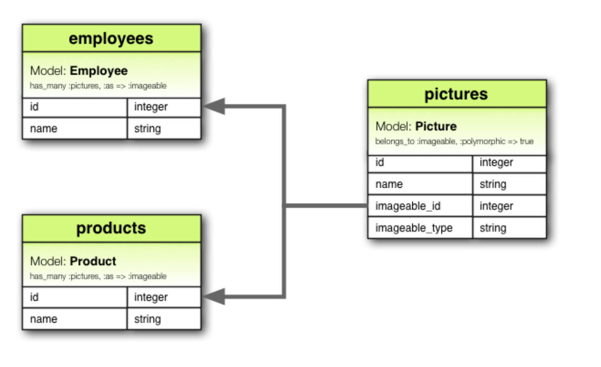

- reference: https://guides.rubyonrails.org/association_basics.html#polymorphic-associations
- all notes from this flex time were taken from the link above

```ruby
class CreatePictures < ActiveRecord::Migration
  def change
    create_table :pictures do |t|
      t.string  :name
      t.bigint  :pictureable_id
      t.string  :pictureable_type
      t.timestamps
    end
  end
end

#alternatively 

class CreatePictures < ActiveRecord::Migration
  def change
    create_table :pictures do |t|
      t.string :name
      t.references :pictureable, polymorphic: true
      t.timestamps
    end
  end
end
```




* A slightly more advanced twist on associations is the polymorphic association. With polymorphic associations, a model can belong to more than one other model, on a single association. For example, you might have a picture model that belongs to either an employee model or a product model. Here's how this could be declared:

```ruby
class Picture < ApplicationRecord

    belongs_to :pictureable, polymorphic: true

end
 
class Employee < ApplicationRecord

    has_many :pictures, as: :pictureable

    # the above can also be written like this: 
    has_many :pictures,
      foreign_key: :pictureable_id,
      class_name: :Picture
end
 
class Product < ApplicationRecord

    has_many :pictures, as: :pictureable

    # or:
    has_many :pictures,
      foreign_key: :pictureable_id,
      class_name: :Picture
end
```

